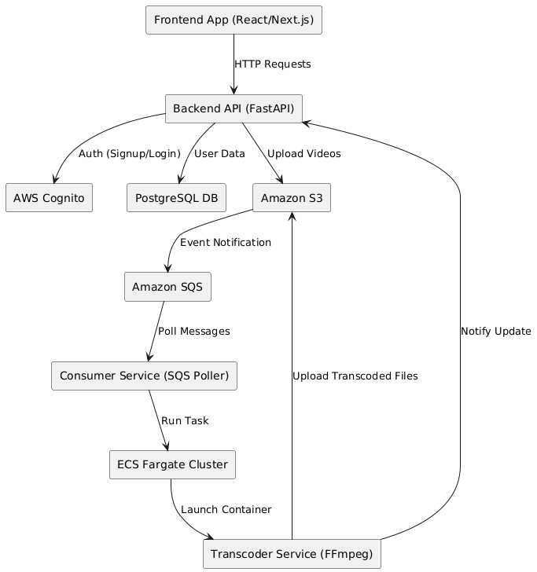

# 🎬 Microservices-Based Video Processing Platform

This project is a scalable, microservices-oriented platform for user authentication and secure video processing, built using FastAPI, AWS services (Cognito, S3, SQS, ECS), and FFmpeg.

---

## 📌 Architecture Overview



---

## 🧩 Microservices

### 1. 🔐 Authentication and User Management (FastAPI)
- Uses AWS Cognito for secure user signup, login, OTP confirmation, and token refreshing.
- Stores user metadata (name, email, Cognito sub) in a PostgreSQL database via SQLAlchemy.
- Provides a secure cookie-based session mechanism using `access_token` and `refresh_token`.

### 2. 📦 Consumer Service
- Polls messages from an SQS queue triggered by S3 file uploads.
- Launches ECS Fargate tasks to transcode uploaded videos.
- Reads environment configuration using `pydantic-settings`.

### 3. 🎥 Transcoder Service
- Runs inside ECS Fargate and uses FFmpeg to convert video files to adaptive streaming (DASH) formats.
- Downloads video from S3, transcodes to 360p, 720p, and 1080p, and uploads processed videos to another S3 bucket.
- Notifies the backend to update video processing status.

---

## 🛠 Technologies

- **Backend:** FastAPI, SQLAlchemy, PostgreSQL
- **Cloud Services:** AWS Cognito, S3, SQS, ECS Fargate
- **Processing:** FFmpeg
- **Containerization:** Docker
- **Config Management:** `pydantic-settings`, `.env` files
- **DevOps:** Docker Compose (for local DB & FastAPI)

---

## 📁 Project Structure
. ├── backend/ │ ├── main.py │ ├── routes/ │ ├── services/ │ ├── db/ │ ├── Dockerfile │ └── ... ├── consumer/ │ ├── main.py │ └── Dockerfile ├── transcoder/ │ ├── main.py │ ├── transcode_video.py │ └── Dockerfile ├── architecture_diagram.png └── README.md

---

## 🚀 Running Locally

### 1. 🐳 Docker Compose for Backend & DB
```bash
docker-compose up --build

# Example for consumer
cd consumer
python3 main.py
